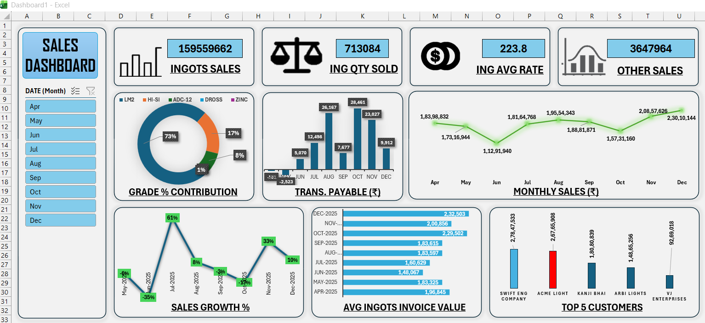

# Sales_Dashboard
Interactive Sales Dashboard built in Excel to track Monthly sales, Ingots quantity, customer performance, grade contribution, and financial insights. Includes charts, slicers, and automated metrics.
# Excel Sales Dashboard

This project is an interactive Sales Dashboard built in Microsoft Excel.  
It helps track and visualize key sales metrics such as:

- Total ingots sales
- Quantity sold
- Average rate
- Other sales
- Monthly sales trends
- Grade % contribution
- Transport payable
- Average invoice values
- Sales growth %
- Top 5 customers

## Features

- Fully automated Excel dashboard
- Slicer for month selection
- Dynamic charts and KPIs
- Clean visual layout
- Easy to update with new data

## Tools Used

- Microsoft Excel
- Power Pivot
- Pivot Tables
- Charts

## 📊 Sales Dashboard Preview

👉 **Download Excel file:**  
[Vansh Sales_Dashboard.xlsx](Vansh_Sales_Dashboard.xlsx)
